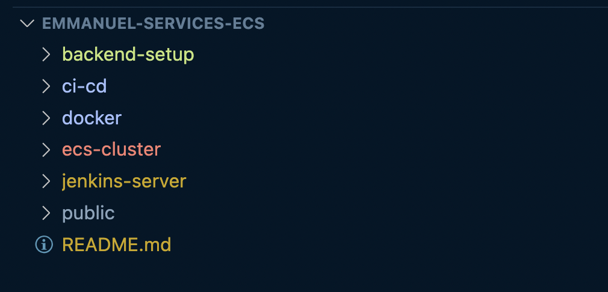

# Code Challenge By Emmanuel Naweji

## Project Structure 


## Step 1: Create S3 Bucket and DynamoDB Table for Backend Remote
- Modify the terraform.tfvars file as necessary. 
- Initialize, Review and Apply the Configurations. 
```sh
cd backend-setup
terraform init
terraform plan
terraform apply -auto-approve
```

---

## Step 2: Modify the following files as desired in the **ecs-cluster** directory: 
- **build-push-backend.sh**
- **build-push-frontend.sh**
- **local.tf**. 

- Make the scripts executable.
```sh
cd ecs-cluster/
chmod +x build-push-backend.sh
chmod +x build-push-frontend.sh
```

- Run the following commands: 
```sh
terraform init
terraform plan
terraform apply -auto-approve
```

#### What the above commands will do: 
- Create two Elastic Container Repositories for Flask and Angular. 
- Build and push a Flask Backend image and an Angular Frontend image to ECR. 
- Create an ECS cluster.
- Create Load Balancer and Target Group for both Flask Backend and Angular Frontend. 
- Create ECS services for Flask Backend and Angular Frontend.

---

## Step 3: Go the **jenkins-server** directory
- Modify the terraform.tfvars file as necessary. 
- Initialize, Review and Apply the Configurations. 
```sh
cd backend-setup
terraform init
terraform plan
terraform apply -auto-approve
```
- Access the Jenkins Server
```sh
chmod 400 jenkins-key.pem  #
ssh -i jenkins-key.pem user-name@<EC2-PUBLIC-IP>  # To SSH into your Jenkins Server. 
```
- Go to the Jenkins UI by using this URL: 
```plaintext
http://your-public-ec2-ip:8080
```

### Configure Jenkins
- Generate temporary password
```sh
sudo cat /var/lib/jenkins/secrets/initialAdminPassword
```
- Install suggested Plugins 
- Create Admin User
- Dashboard -> Manage Jenkins -> Global Properties -> Environment variables

